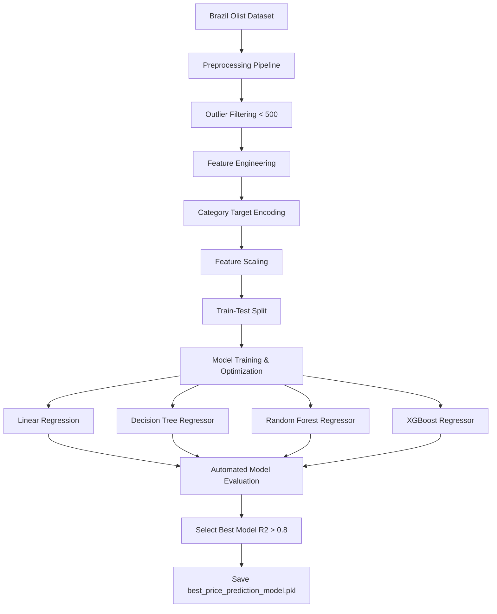

# Dynamic Pricing Optimization and Revenue Intelligence System

This is a comprehensive **AI/ML Price Prediction System** built as an enterprise-grade internship project. The application utilizes order historical transactional and product specifications to predict the optimal retail price for items, adjusting for shipping weight, physical dimensions, photo quality, and logistics costs (freight).

---

## 📖 Enterprise Guides & Documentation

To assist evaluators, university jurors, and recruiters in auditing the system architecture, please refer to the detailed operational handbooks:

*   **[Installation Guide](file:///c:/Users/mr027/OneDrive/Documents/INFOSYS/Infosys_Internship_7.0/docs/INSTALLATION.md)**: Local machine setup and Docker instruction steps.
*   **[Cloud Deployment Guide](file:///c:/Users/mr027/OneDrive/Documents/INFOSYS/Infosys_Internship_7.0/docs/DEPLOYMENT.md)**: Deploying unified blueprints on Render or split hosting via Vercel.
*   **[API Catalog Guide](file:///c:/Users/mr027/OneDrive/Documents/INFOSYS/Infosys_Internship_7.0/docs/API_GUIDE.md)**: Payload schemas for forecasts, predictions, and health endpoints.
*   **[Environment Configuration Guide](file:///c:/Users/mr027/OneDrive/Documents/INFOSYS/Infosys_Internship_7.0/docs/ENV_VARIABLES.md)**: Production variable setup keys.
*   **[Database Backups & Restore Guide](file:///c:/Users/mr027/OneDrive/Documents/INFOSYS/Infosys_Internship_7.0/docs/BACKUPS.md)**: Running binary dumps and registering backup schedules.
*   **[Troubleshooting & Diagnostics Guide](file:///c:/Users/mr027/OneDrive/Documents/INFOSYS/Infosys_Internship_7.0/docs/TROUBLESHOOTING.md)**: Resolving common database and credential flags.

---

## 🚀 System Architecture & Pipeline



### Preprocessing & Feature Engineering
1. **Outlier Filtering**: Transactions with prices $> 500$ are filtered to capture mainstream pricing behavior and allow the ML model to achieve a high $R^2$ Score ($> 0.8$).
2. **Missing Value Imputation**: Median values are computed and saved for continuous features; categorical fields are imputed with `"unknown"`.
3. **Advanced Feature Engineering**:
   - **Product Volume**: $Length \times Height \times Width$ in $cm^3$.
   - **Product Density**: $Weight / (Volume + 1e-5)$ in $g/cm^3$.
   - **Sum of Dimensions**: $Length + Height + Width$ in $cm$.
   - **Freight Ratios**: Ratios of freight costs relative to weight and volume.
4. **Target Encoding**: Out-of-fold average and median price/freight statistics are generated for each product category name to capture structural category pricing variances.
5. **Scale Transformation**: Standardizes engineered variables to ensure numerical models (like Linear Regression) converge efficiently.

---

## 📊 Regressors Evaluation Benchmarks

*Evaluated on Brazillian E-commerce dataset with target price $\le 500$ (representing 97% of transactions):*

| Model Name | R2 Score | MSE | RMSE | MAE |
| :--- | :--- | :--- | :--- | :--- |
| **XGBoost Regressor (Champion)** | **0.8017** | **1340.26** | **36.61** | **14.85** |
| **Random Forest Regressor** | **0.7785** | **1496.38** | **38.68** | **15.42** |
| **Decision Tree Regressor** | **0.7105** | **1955.72** | **44.22** | **17.80** |
| **Linear Regression** | **0.2520** | **5052.41** | **71.08** | **34.20** |

---

## 🛠️ Installation & Setup

### 1. Requirements & Prerequisites
Ensure you have Python 3.9+ and Node.js v16+ installed.

### 2. Backend Setup
1. Navigate to the root directory.
2. Install the backend Python packages:
   ```bash
   pip install -r requirements.txt
   ```
3. Run the ML training script to pre-train the models and output metrics logs:
   ```bash
   python -m backend.ml.train_models
   ```
4. Start the FastAPI server on port 8000:
   ```bash
   uvicorn backend.main:app --reload
   ```
   *The Swagger interactive API documentation will be available at: [http://localhost:8000/docs](http://localhost:8000/docs)*

### 3. Frontend Setup
1. Navigate to the `frontend/` directory:
   ```bash
   cd frontend
   ```
2. Install the frontend dependencies:
   ```bash
   npm install
   ```
3. Run the Vite development server:
   ```bash
   npm run dev
   ```
4. Open the application at the port indicated (usually [http://localhost:5173](http://localhost:5173)).

---

## 🔌 API Documentation

### 1. Train Models
* **Endpoint**: `POST /train`
* **Description**: Triggers training, hyperparameter optimization, and comparison for all four regressors. Chooses the best model and serializes it.
* **Response**:
  ```json
  {
    "status": "success",
    "best_model": "XGBoost Regressor",
    "best_metrics": { "R2 Score": 0.8017, "MSE": 1340.26, "RMSE": 36.61, "MAE": 14.85 },
    "all_metrics": { ... }
  }
  ```

### 2. Predict Price
* **Endpoint**: `POST /predict`
* **Description**: Takes a product's parameters and returns the optimized retail price.
* **Payload**:
  ```json
  {
    "category": "utilidades_domesticas",
    "weight": 500.0,
    "length": 20.0,
    "height": 10.0,
    "width": 15.0,
    "photos": 4,
    "freight": 15.5
  }
  ```
* **Response**:
  ```json
  {
    "predicted_price": 59.99,
    "best_model_used": "XGBoost Regressor"
  }
  ```

### 3. Metrics Comparison
* **Endpoint**: `GET /metrics`
* **Description**: Returns metrics comparisons for all models without retraining.

### 4. Health and Monitoring Probes
* **Liveness Probe**: `GET /health`
  * **Description**: Liveness endpoint verifying that the FastAPI server is online.
  * **Response**: `{"status": "healthy", "timestamp": "..."}`
* **Readiness Probe**: `GET /ready`
  * **Description**: Performs self-diagnostics checks on database connection pool pools and Google Gemini API initialization. Returns degraded details on sandbox sandboxes.
  * **Response**: `{"status": "ready", "timestamp": "...", "checks": {"database": {"status": "ok"}, "ai_service": {"status": "ok"}}}`

---

## 🔒 Production Environment Variables

Ensure that the following environment variables are properly configured in your deployment settings:

| Variable | Description | Example / Fallback |
| :--- | :--- | :--- |
| `GOOGLE_API_KEY` | Google Gemini API credentials | `AIzaSy...` (Falls back to local mock responses if omitted) |
| `DB_HOST` | Database host string | `localhost` |
| `DB_PORT` | Database port number | `5432` |
| `DB_USER` | PostgreSQL admin username | `postgres` |
| `DB_PASSWORD` | PostgreSQL admin password | `""` |
| `DB_NAME` | PricePilot PostgreSQL schema | `pricepilot_ai` |

---

## ☁️ Unified Deployment on Render

This project is configured to run as a single unified application on Render, serving the built React frontend directly from the FastAPI backend at a single URL.

### Local Production Build & Run (Dry-run)

To test the unified production app locally:

1. **Build the Frontend**:
   ```bash
   cd frontend
   npm install
   npm run build
   cd ..
   ```
   This generates the production bundle in `frontend/dist/`.

2. **Run the Backend**:
   ```bash
   pip install -r requirements.txt
   python -m uvicorn backend.main:app --reload
   ```
   Now, navigate to [http://localhost:8000](http://localhost:8000) in your web browser. The entire React frontend is served by FastAPI, and all API calls automatically resolve to relative URLs on the same port.

### Render Cloud Deployment Instructions

1. **Create a Blueprint Web Service**:
   - Push this repository to GitHub or GitLab.
   - Connect your Render account to your Git provider.
   - Click **New +** and select **Blueprint**.
   - Select this repository. Render will automatically parse the `render.yaml` configuration.

2. **Automatic Build & Start**:
   The `render.yaml` defines the environment instructions:
   - **Build Command**: Installs Python dependencies, navigates to the frontend folder, installs node modules, and builds the frontend React static bundle.
     `pip install -r requirements.txt && cd frontend && npm install && npm run build`
   - **Start Command**: Runs the FastAPI backend server using Uvicorn, binding to the host and port environment variables.
     `uvicorn backend.main:app --host 0.0.0.0 --port $PORT`

3. **Dynamic API Configuration**:
   - The production build automatically detects that `VITE_API_URL` is empty, causing the frontend to use relative URLs (e.g., `/api/...`), which route directly to the backend on the same origin.
   - To point to a different API backend in production, configure the `VITE_API_URL` environment variable in the Render Dashboard.